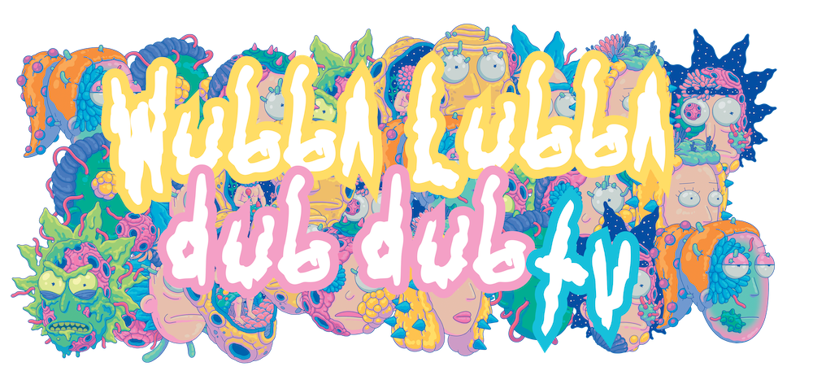
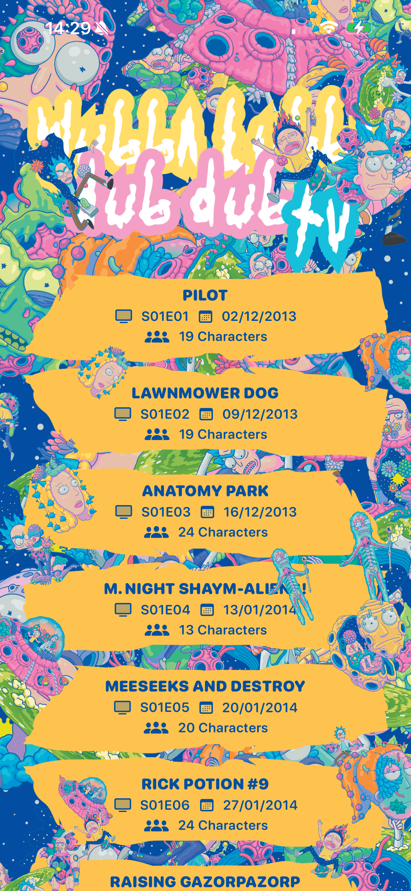
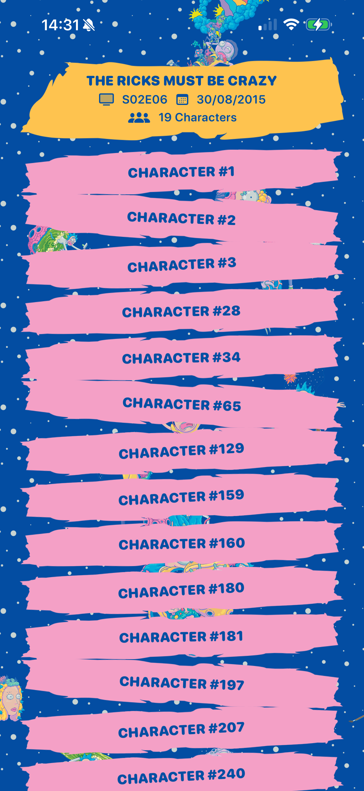
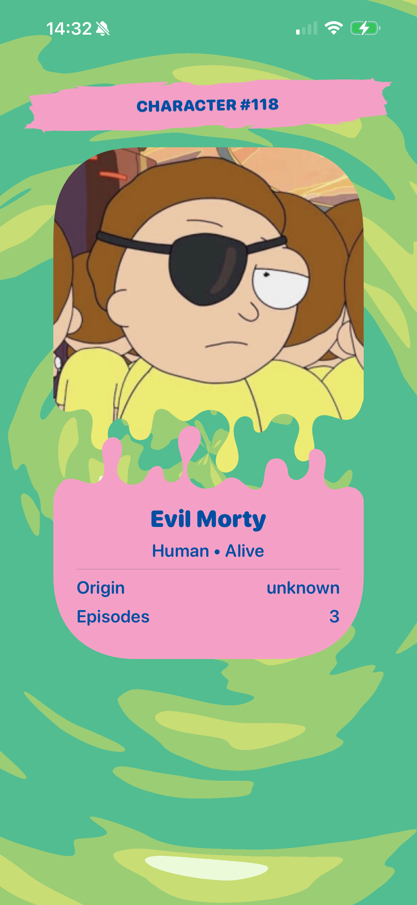

<p align="center">
  
</p>

# WubbaLubbaDubDubTV

*Wubba lubba dub dub!* A Rick and Morty episodes browser that's more fun than interdimensional cable TV. 

This SwiftUI app lets you explore all Rick and Morty episodes with out of this world parallax effects and other very toxic UI that would make even Rick proud (well, maybe).

<p align="center">
  
  
  
</p>

## API & Services

### Rick and Morty API Integration
We're tapping into the [Rick and Morty API](https://rickandmortyapi.com) using the `RickMortySwiftApi` Swift package. No need to build our own portal gun when someone else already did the hard work!

**Main Service Layer (`RMService.swift`):**
- Fetches paginated episodes and characters
- Handles concurrent character lookups (because waiting is for Jerry)
- Protocol-based design for easy testing and mocking
- Built-in pagination support (20 items per page)

**Key Features:**
- Async/await throughout (no callback hell here)
- Concurrent character fetching using TaskGroup
- Page-based data loading for smooth scrolling

## Architecture

### The Good Stuff (Clean Architecture)
This app follows a clean architecture pattern:

```
┌─────────────────┐
│   SwiftUI Views │ ← The pretty stuff users see
├─────────────────┤
│   ViewModels    │ ← Business logic lives here  
├─────────────────┤
│   Repositories  │ ← Data coordination layer
├─────────────────┤
│   Services      │ ← API calls and external data
├─────────────────┤
│   SwiftData     │ ← Local persistence
└─────────────────┘
```

### Dependency Injection Container (`AppContainer`)
We use a custom DI container that bootstraps everything at app startup:
- **RMService**: API communication
- **EpisodesRepository**: Episode data management with caching
- **CharactersRepository**: Character data with smart fetching
- **ModelContainer**: SwiftData persistence layer

### Data Flow
1. **Views** observe **ViewModels** using `@Observable`
2. **ViewModels** coordinate with **Repositories** for data operations
3. **Repositories** manage both local cache (SwiftData) and remote API calls
4. **Services** handle the actual API communication

### Persistence Layer (SwiftData)
- **EpisodeEntity**: Stores episodes with character references
- **CharacterEntity**: Caches character details locally
- Smart upsert logic prevents duplicate data
- Automatic relationship mapping between episodes and characters

## UI & Design

### Design System (`DesignTokens.swift`)
We've got our own design tokens because consistency matters:

**Padding System:**
- `outer`: 24pt (for major spacing)
- `inner`: 8pt (for tight spaces)
- Consistent multipliers (`outerDouble`, `innerHalf`, etc.)

**Typography:**
- Custom rounded fonts with multiple weights
- Primary/Secondary hierarchy for different UI levels
- All using San Francisco Rounded for that friendly vibe

### Visual Effects & Components

#### Parallax Magic (`ParallaxView.swift`)
Custom parallax implementation that makes scrolling feel interdimensional:
- Multiple layers with different scroll speeds
- Random element positioning and sizing
- Wrapping logic for infinite scroll feel
- Canvas-based rendering for performance

#### Portal Effects (`RMPortalView.swift` + Metal Shaders)
Because what's a Rick and Morty app without portal effects?
- **Metal shader** (`RMPortalShader.metal`) for custom portal rendering
- Animated time-based effects using `TimelineView`
- Custom color gradients that pulse and shift
- 60fps animation for smooth portal vibes

#### R&M-Themed Assets
The app ships with a full Rick and Morty asset library:
- **Episode cell backgrounds**: Various R&M-themed images
- **Character portraits**: Cached and displayed efficiently  
- **Background elements**: Blobs, cells, and other random R&M imagery
- **Color palette**: Blues, greens, yellows, and pinks derived from the imagery
- **Pattern backgrounds**: Repeating R&M elements for texture

### Key UI Components

**EpisodeView**: Clean episode cards with:
- Episode name, code, and air-date
- Character count indicators
- R&M-themed cell backgrounds
- Smooth matched geometry transitions

**ParallaxView**: Floating background elements that:
- Move at different speeds when scrolling
- Randomly position and scale R&M imagery
- Create depth and visual interest
- Clear the center area for content readability

**Custom Refresh**: Pull-to-refresh with loading indicator

### Navigation & UX
- **NavigationStack** for clean iOS navigation
- **Matched geometry transitions** between list and detail views
- **Lazy loading** with infinite scroll pagination
- **Dark mode preferred** (because it's dark out there)
- **Smooth animations** throughout the experience

---

### Get Schwifty!
* I hope you enjoy playing with the app andgoing through the code.

---

### Copyright©
* Adult Swim All Rights Reserved.
* Images [Behance](https://www.behance.net/gallery/90220333/Rick-and-Morty-Style-Guide)